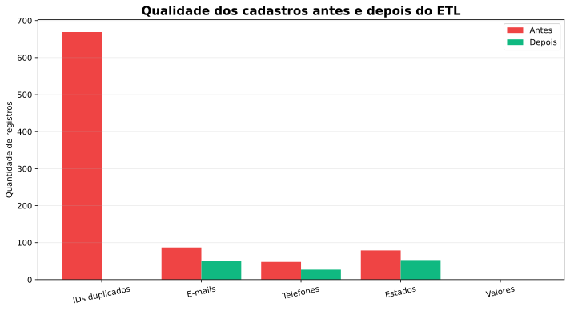

# Pipeline ETL para qualidade de dados

Este projeto nasceu como um exercício de limpeza de cadastros. Montei uma base fictícia com problemas que aparecem com frequência em arquivos reais: clientes repetidos, nomes escritos de formas diferentes, telefones incompletos, e-mails inválidos, datas misturadas e valores no formato brasileiro.

O objetivo foi criar um processo que pudesse ser executado novamente, sempre com as mesmas regras.



## Fluxo do projeto

```text
CSV bruto -> diagnóstico -> padronização -> validação -> deduplicação -> CSV tratado + relatório
```

## O que o pipeline faz

- padroniza nomes, telefones, estados, datas e valores monetários;
- valida e-mails com uma regra simples;
- identifica IDs duplicados;
- mantém a versão mais recente de cada cadastro;
- cria uma coluna que indica se o registro está completo;
- salva um relatório comparando a qualidade antes e depois.

## Resultado do teste

A base gerada possui 900 linhas. Nela, o pipeline encontrou 669 ocorrências relacionadas a IDs duplicados e removeu 400 versões antigas. Depois do tratamento, não restaram IDs duplicados.

Os campos inválidos não são preenchidos com valores inventados. Eles ficam nulos e o cadastro é sinalizado para revisão. Escolhi essa abordagem para não esconder problemas da fonte.

## Tecnologias que pratiquei

Python, Pandas, expressões regulares, ETL, SQL, Matplotlib e Pytest.

## Como executar

```bash
python -m venv .venv
# Windows: .venv\Scripts\activate
pip install -r requirements.txt
python generate_data.py
python src/pipeline.py
pytest -q
```

As regras estão detalhadas em [`docs/regras_de_qualidade.md`](docs/regras_de_qualidade.md).

## Limitações que identifiquei

- a validação de e-mail é propositalmente simples;
- o telefone considera o padrão brasileiro de 11 dígitos;
- o mapa de estados cobre apenas os valores presentes na base de estudo;
- registros nulos ainda precisam de uma etapa de revisão humana.

## Próximo passo

Quero separar os registros rejeitados em um arquivo próprio, com o motivo de cada rejeição, e criar mais testes para entradas fora do padrão.
